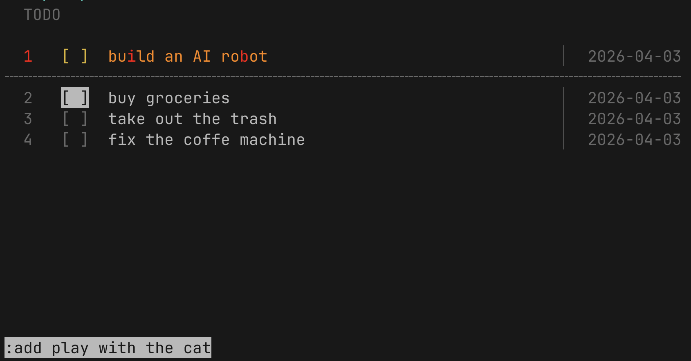

# todo

A TUI todo app. Single file, standard lib only. Navigate items with arrow keys and manage them via vim-style commands prefixed with `:`

- `:a <text>` — Add item
- `:p<index>` — Pin item to the topa nd animates it with flowing amber→red wave
- `:rm<index>` — Remove item (requires confirmation)
- `:q` — Quit

All data persists to a SQLite database in `~/.todo/todo.db.`

